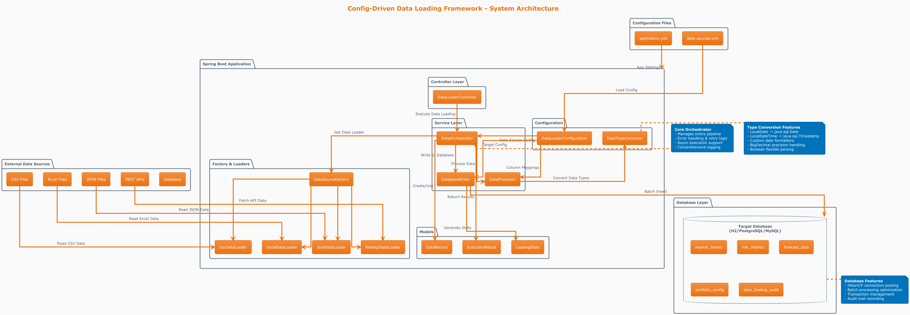
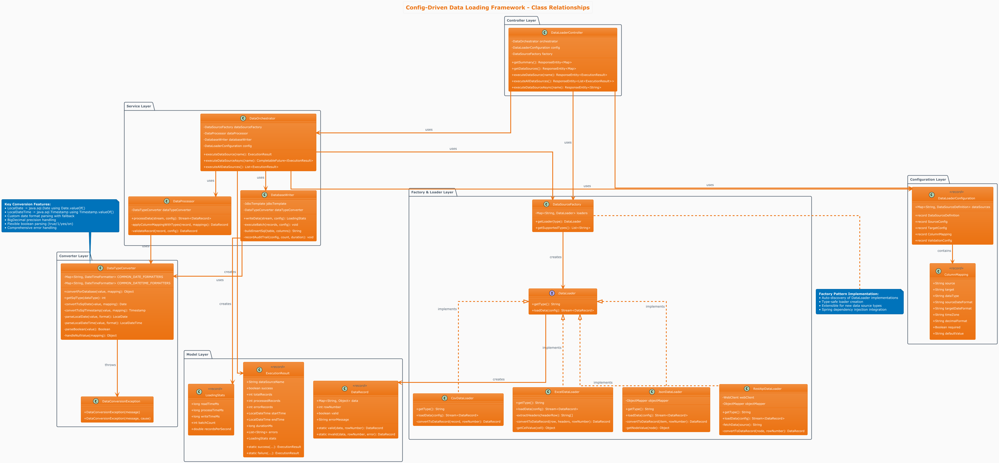
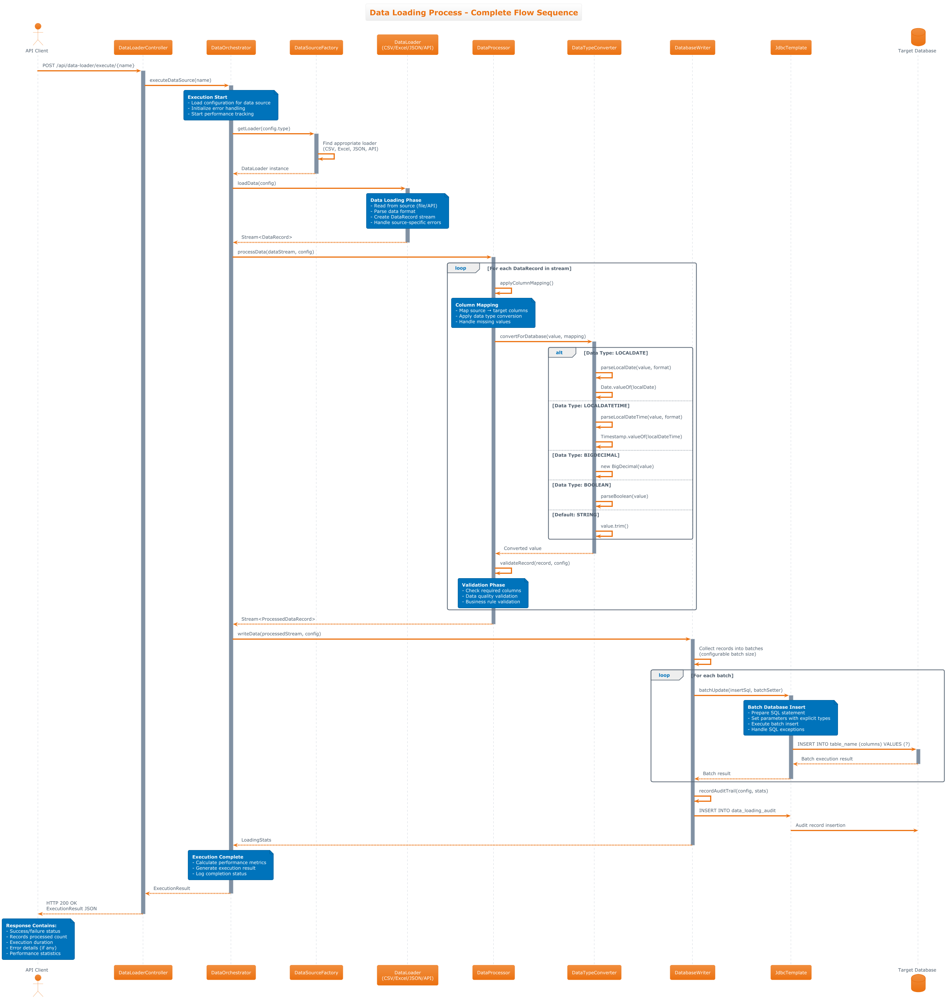

# Config-Driven Data Loading Framework

Framework that eliminates repetitive data loading code by using configuration files. Instead of writing custom code for each data source, we configure once and reuse everywhere.

## **Framework Architecture**

```
┌─────────────────┐    ┌──────────────────┐    ┌─────────────────┐
│   DATA SOURCES  │    │   ORCHESTRATOR   │    │  Database       │
│                 │    │                  │    │    Schema       │
│ • CSV Files     │────│ Config Reader    │────│                 │
│ • Excel Files   │    │ Data Processor   │    │ • api_data      │
│ • REST APIs     │    │ Column Mapper    │    │ • market_trends │
│ • JSON Files    │    │ Database Writer  │    │ • risk_metrics  │
└─────────────────┘    └──────────────────┘    └─────────────────┘
```

## **Core Components**

- **DataSourceFactory**: Creates appropriate loaders based on configuration type  
- **DataOrchestrator**: Manages the entire pipeline with error handling and retry logic [One Time Implementation]  
- **DataProcessor**: Handles transformations and column mapping  
- **DatabaseWriter**: Executes batch operations to Database schema tables  

---

## **Sample Configuration Files**

### **Data Sources Configuration (data-sources.yml)**
```yaml
# Data Sources Configuration for Database Schema
data_sources:
  market_data_csv:
    type: "csv"
    source:
      file_path: "/data/market/daily_rates.csv"
      delimiter: ","
      header: true
      encoding: "UTF-8"
    target:
      schema: "MarketData"
      table: "market_trends"
      batch_size: 500
    column_mapping:
      - source: "date" → target: "trade_date"
      - source: "currency_pair" → target: "currency"
      - source: "rate" → target: "exchange_rate"
      - source: "volume" → target: "trading_volume"
  risk_metrics_excel:
    type: "excel"
    source:
      file_path: "/data/risk/monthly_risk.xlsx"
      sheet_name: "RiskData"
      skip_rows: 1
    target:
      schema: "RiskMetrics"
      table: "risk_metrics"
      batch_size: 200
    column_mapping:
      - source: "Portfolio ID" → target: "portfolio_id"
      - source: "VaR 95%" → target: "var_95"
      - source: "Expected Shortfall" → target: "expected_shortfall"
      - source: "Liquidity Score" → target: "liquidity_score"
    validation:
      required_columns: ["Portfolio ID", "VaR 95%"]
      data_quality_checks: true
  rest_api_data:
    type: "rest_api"
    source:
      url: "https://api.provider.com/v1/liq"
      method: "GET"
      headers:
        Authorization: "Bearer ${API_TOKEN}"
        Content-Type: "application/json"
      timeout: 30
      retry_attempts: 3
    target:
      schema: "APIData"
      table: "forecast_data"
      batch_size: 1000
    column_mapping:
      - source: "id" → target: "id"
      - source: "assetClass" → target: "asset_class"
      - source: "predictedLiquidity" → target: "predicted_liquidity"
      - source: "confidenceLevel" → target: "confidence_level"
      - source: "forecastDate" → target: "forecast_date"
  config_json:
    type: "json"
    source:
      file_path: "/config/portfolio_settings.json"
      json_path: "$.portfolios[*]"
    target:
      schema: "ConfigData"
      table: "portfolio_config"
      batch_size: 100
    column_mapping:
      - source: "id" → target: "portfolio_id"
      - source: "name" → target: "portfolio_name"
      - source: "riskProfile" → target: "risk_profile"
      - source: "liquidityThreshold" → target: "liquidity_threshold"

# Global Settings
global_settings:
  error_handling:
    continue_on_error: true
    error_threshold: 10
    notification_email: "dev-team@company.com"
  data_quality:
    enable_validation: true
    null_value_handling: "skip"
    duplicate_handling: "ignore"
  performance:
    connection_pool_size: 10
    query_timeout: 300
    memory_limit: "2GB"
```

## **High Level Architecture Diagram**



## **Class Diagram**


## Sequence Diagram


## **Key Developer Benefits**

- **Code Reusability**: Write once, configure multiple times - no duplicate data loading logic
- **Maintenance Reduction**: Single codebase handles all data sources through configuration
- **Easy Onboarding**: New data sources added via YAML files, not code changes
- **Error Handling**: Built-in retry logic and comprehensive error reporting
- **Performance**: Batch processing and connection pooling optimize database operations
