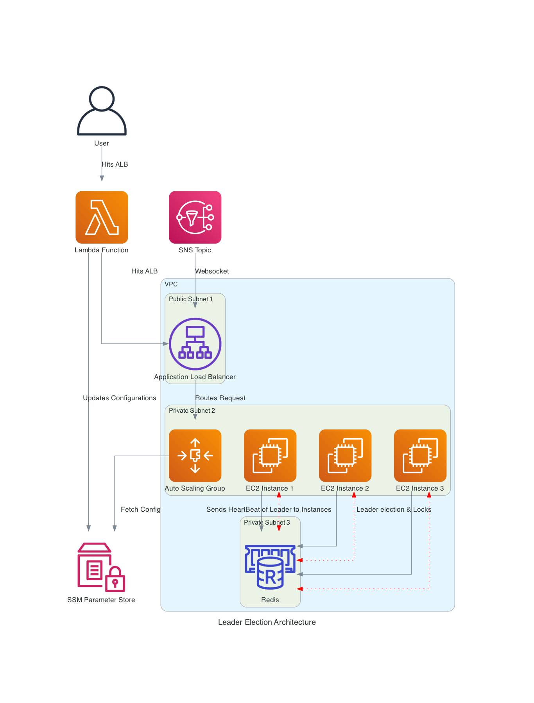

## Initialize the project
```
cdk init app --language typescript
npm install
```

## Minimal Permissions Required for Bootstrap

```
{
  "Version": "2012-10-17",
  "Statement": [
    {
      "Effect": "Allow",
      "Action": [
        "cloudformation:*",
        "s3:*",
        "iam:*",
        "ecr:*",
        "ssm:*"
      ],
      "Resource": "*"
    }
  ]
}
```

## Bootstrapping

```
cdk bootstrap
cdk deploy
```

## Useful commands

* `npm run build`   compile typescript to js
* `npm run watch`   watch for changes and compile
* `npm run test`    perform the jest unit tests
* `npx cdk deploy`  deploy this stack to your default AWS account/region
* `npx cdk diff`    compare deployed stack with current state
* `npx cdk synth`   emits the synthesized CloudFormation template
